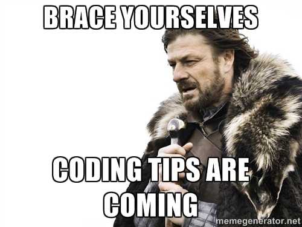

# Trailer

## Script
**[Animation intro]**

> Hi, welcome to **Code my Life.**

What is this?
> This YouTube channel is about 
> How to use coding to improve our lives.

Who am I?
> My name is Jorge Cuadra, I'm a Software Engineer based in California.

Why do I do it?
> Throughout my journey to become a Software Engineer, I've received a lot of help from the *software community*. 

> That's why I feel the commitment to pay it forward by sharing my learnings with others.

[ **Meme:** Brace yourselves because tips are coming.]
[meme generator](https://memegenerator.net/instance2/5138173)

Who is this channel for?
> - If you like coding or you are interested in coding, you should **watch** this channel.
> - If you feel your life sucks 90%, you **definitely** need to watch this channel
> - If your life sucks 20% you **need** to watch this channel
> - If your life sucks 1% or less, you *still* need to watch this channel

How can code help you?
> - learn tips and tricks to be faster at your job
> - take advantage of apps you already have installed like your browser

Closing
> So be proactive and subscribe right now, to receive tips and tricks from **Code my life**